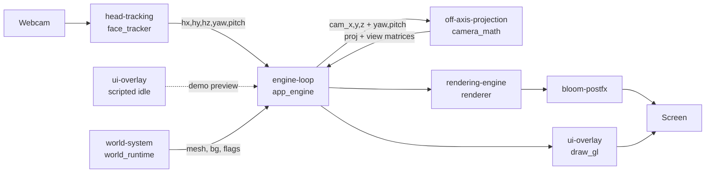
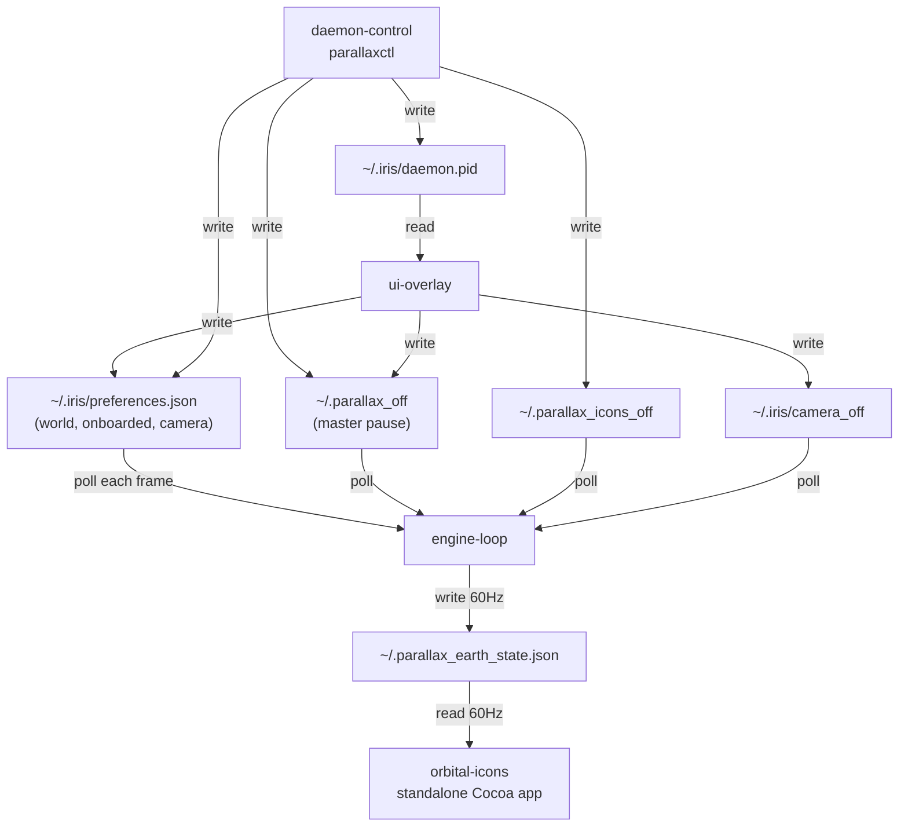

# System Interactions

How the pieces fit together. IRIS is a set of modular systems coordinated by one
frame loop ([[engine-loop-and-daemon]]; 60 fps demo / 30 fps wallpaper) and a
handful of small files on disk that act as the cross-process message bus.

## Import / startup chain

```
Iris.app  →  launcher.py (root)        # put project root / _MEIPASS on sys.path
          →  Launcher/app_entry.py     # choose PARALLAX_MODE (default "demo")
          →  Launcher/app_engine.main()
                 ├─ Tracking/face_tracker.py    (head input)
                 ├─ Engine/camera_math.py       (off-axis projection)
                 ├─ Engine/renderer.py          (Earth/Eye/Stars/Nebula/IconOrbit)
                 ├─ Engine/bloom_postfx.py      (bloom)
                 ├─ Worlds/world_runtime.py     (active world)
                 └─ UI/demo_overlay.py          (HUD, demo mode only)
```

## Per-frame data flow

Every frame the engine pulls input, turns it into matrices, composes the world,
and presents it:



The projection/view/sun are **world-agnostic** — only the drawn assets change per
world — so the parallax/zoom/rotation feel is identical for [[earth]] and
[[the-watcher]]. See [[off-axis-projection]] for the matrix math and
[[engine-loop-and-daemon]] for the per-component gains.

## Files as the message bus

IRIS deliberately uses small files in `~/` and `~/.iris/` as its inter-process
contract instead of sockets. The engine polls them each frame, so any writer
(the demo UI, the CLI, or a hand edit) takes effect live, in every running
process. (This "the flags ARE the IPC" choice is covered in [[design-decisions]].)



| File | Writer(s) | Reader(s) | Purpose |
|---|---|---|---|
| `~/.iris/preferences.json` | [[ui-overlay]], [[daemon-control]] | [[world-system]], [[ui-overlay]] | Active world + onboarding/camera prefs |
| `~/.parallax_off` | [[ui-overlay]], [[daemon-control]] | [[engine-loop-and-daemon]] | Master pause (hide + release camera) |
| `~/.parallax_icons_off` | [[ui-overlay]], [[daemon-control]] | engine, [[orbital-icons]] | Hide orbital icons |
| `~/.iris/camera_off` | [[ui-overlay]] | [[engine-loop-and-daemon]] | Camera-access switch |
| `~/.iris/daemon.pid` | [[daemon-control]] / spawn | [[ui-overlay]] | Detect a running wallpaper |
| `~/.parallax_earth_state.json` | [[engine-loop-and-daemon]] | [[orbital-icons]] (standalone) | Live camera state for 2-D/3-D icon alignment |

## Camera ownership handoff

macOS allows one camera consumer at a time, so the systems coordinate ownership:
the demo holds the camera while onboarding; enabling Desktop Mode either converts
the window in-process (keeping the grant) or hands off to a detached daemon that
re-acquires the freed camera. See [[head-tracking]] and [[engine-loop-and-daemon]].

## Validation mirror

The validation harness ([[headless-simulation]]) imports the *same* modules the
loop uses — `camera_math`, `face_tracker`, `demo_overlay` — and drives them
without a GPU or camera, so the verified behaviour and the live behaviour can't
diverge.

## Packaging

`Build/build_dmg.sh` freezes this whole graph (entry `launcher.py`, bundling
`assets/ worlds/ shaders/ models/`) into `Iris.app`. See [[dmg-build-process]].

## Related

[[constraints]] · [[design-decisions]] · [[engine-loop-and-daemon]]
